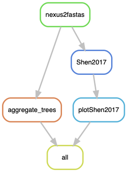
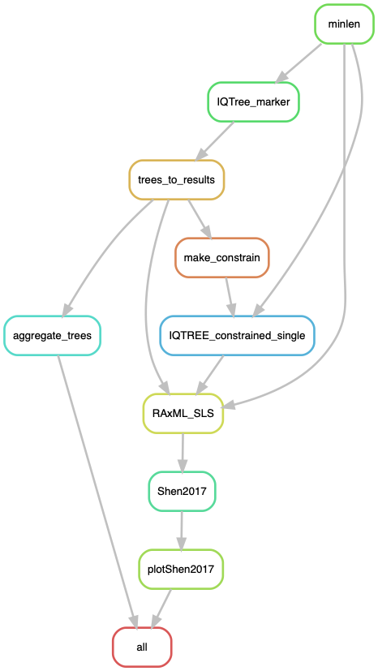

# Podosporaceae phylogeny

In this study we compiled sequence data for a number of molecular markers (ITS, LSU, rpb2, and beta-tubulin) to resolve the phylogenetic relationships of lineages within the Podosporaceae family, sensu [Wang et al. (2019) Studies in Mycology 93:155-252](https://www.sciencedirect.com/science/article/pii/S0166061619300107). The primary objective was to determine the relative position of the model species *Podospora anserina* and the type species of the genus, *Podospora fimiseda*. Unfortunately, there is a lot of missing data.

The **data** required for this pipeline is:

* The master concatenated alignment in nexus format with annotated limits of the markers (`Podosporaceae_20200714.nxs`). You can open it with [SeaView](http://doua.prabi.fr/software/seaview), for example. We submitted it to TreeBase (accession number XXXX) but I had to fit it to the Mesquite nexus format for that. To make the Mesquite file compatible with this pipeline, you can open it in SeaView and save it as a new nexus file. It should work then. In any case, I put the original nexus here in this repo just in case.
* A partition file (in the RAxML style) with the genes to be analyzed by the scripts of [Shen et al. (2017)](https://www.nature.com/articles/s41559-017-0126) to obtain gene-wise log-likelihood scores (dGLS) values: `allmarkers_combining_orders.txt`. 

The **scripts** needed:

* The Snakemake pipeline `Podosporaceae.smk`
* The configuration file of the pipeline `Podosporaceae_config.yaml`
* `1_sitewise_analyzer.pl` and `2_genewise_analyzer.pl` from [Shen et al. (2017)](https://www.nature.com/articles/s41559-017-0126)
* An R script for plotting: `Shen2017_podofam.R`

## The configuration file

The configuration file contains the paths to the necessary files to run the pipeline.
    
    $ cat Podosporaceae_config.yaml
```yaml
# Configuration file of the Podosporaceae.smk pipeline

## Master nexus file
masternex: "data/Podosporaceae_20200714.nxs"

## Name of the full concatenation of all markers in the master nexus file
allmarkersname: "allmarkers"

## RAxML-like partition file to calculate the SLS and GLS metrics (It must be named "{allmarkersname}_combining_orders.txt")
orders: "data/allmarkers_combining_orders.txt"

## Filtering for alignments of individual markers
minfrac: 0.45 # min fraction of overlap with the whole alignment length for a sequence to be considered
minlen: 250 

## Scripts
sitewise_analyzer: "scripts/1_sitewise_analyzer.pl"
genewise_analyzer: "scripts/2_genewise_analyzer.pl" 
plotShen: "scripts/Shen2017_podofam.R"

# Outgroup clade
outgroup: ["Lasiosphaeria_ovina_SMH1538", "Zopfiella_tabulata_CBS230.78", "Sordaria_fimicola_SMH4106", "Diplogelasinospora_princeps_FMR13414", "Chaetomium_globosum_CBS148.51", 'Chaetomium_globosum_CBS160.62', 'Cercophora_mirabilis_CBS120402']
# A representative of clades A, B and C in that order
testmonophyly: ["Podospora_anserina_S", "Cercophora_grandiuscula_CBS120013", "Podospora_fimiseda_CBS990.96"] 

```

## Building the environment

To run the Snakemake pipeline, I constructed a [conda environment](https://docs.conda.io/projects/conda/en/latest/). I assume in the following that you have conda installed already.

I named the environment `LorePhylogenetics`, but you can call it whatever you like :).

    $ conda create -n LorePhylogenetics -c bioconda

    $ conda activate LorePhylogenetics
    $ conda install -c bioconda snakemake-minimal=5.4.4 biopython=1.72 mafft=7.407 iqtree=1.6.8 raxml=8.2.12
    $ conda install r-tidyr=1.1.0 # included dplyr 1.0.0 
    $ conda install r-cowplot=1.0.0 # it comes with ggplot2 3.1.1
    $ conda install -c etetoolkit ete3=3.1.1

## Run pipeline locally

First, to get an idea of how the pipeline looks like we can make a rulegraph:
    
    $ conda install -c pkgs/main graphviz=2.40.1 # already there
    $ snakemake --snakefile Podosporaceae.smk --configfile Podosporaceae_config.yaml --rulegraph | dot -Tpng > rulegraph.png

However, in this case I'm using [Checkpoints](https://snakemake.readthedocs.io/en/stable/snakefiles/rules.html#data-dependent-conditional-execution) right away so almost all of the graph won't be calculated until that checkpoint is ran.



For testing without running the pipeline:
    
    $ conda activate LorePhylogenetics
    $ snakemake --snakefile Podosporaceae.smk --configfile Podosporaceae_config.yaml -pn

To run the pipeline I like to make a screen in case the computer is turned off or something.

    $ screen -R phylo
    $ conda activate LorePhylogenetics
    $ snakemake --snakefile Podosporaceae.smk --configfile Podosporaceae_config.yaml -p -j 40 --keep-going --use-conda &> Podosporaceae.log &
    [1] 40092

Notice the use of the `-j` argument, where I specify the number of threads available for the pipeline.

If we produce the graph again:

    $ snakemake --snakefile Podosporaceae.smk --configfile Podosporaceae_config.yaml --rulegraph | dot -Tpng > rulegraph.png



## Results

After the pipeline runs successfully, there will be a new folder called `results` that contains the individual ML trees of each partition in the nexus file, as well as a plot with the dGLS per marker and the number of sites supporting T1 and T2.

* ShenMetrics.pdf - Figure 4 in the paper; dGLS values per gene (A) and the number of sites supporting each topology for each gene (B) (see below)
* Tree files of all partitions (post filtering)


